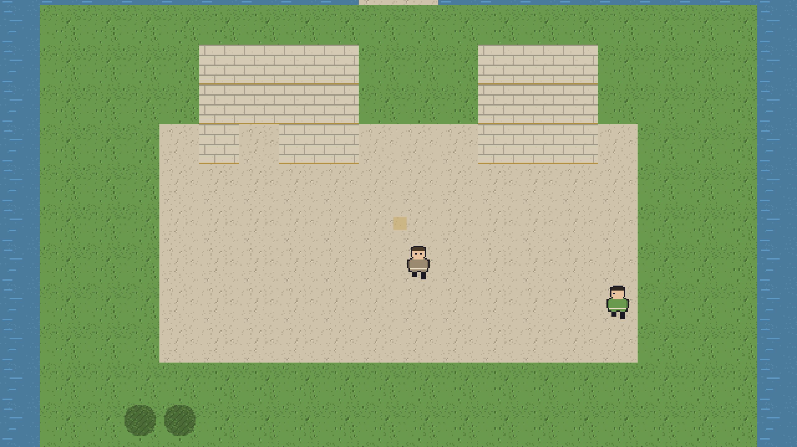
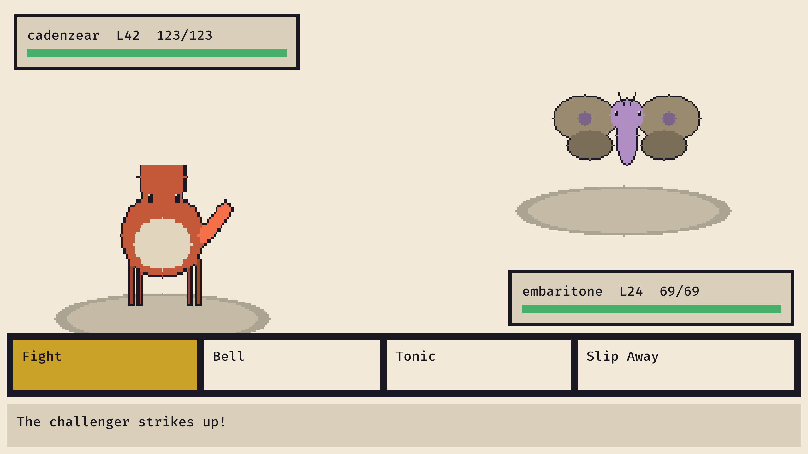
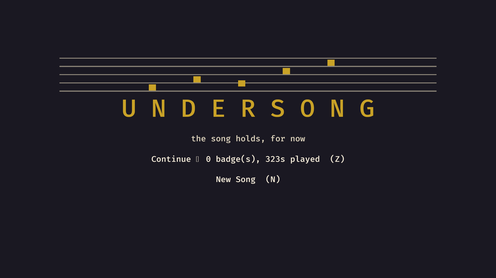

# Undersong

An original monster-taming RPG in the structural tradition of the
GBA/DS era: a grid overworld, turn-based battles, eight badges, an
evil-team arc, a league, three endings, and a post-game. Original IP —
original creatures, world, names, and story.

The world runs on music. Every creature ("Mote") is a fragment of the
**Undersong**, the held chord that keeps the world's physics in tune.
The badge circuit is not what it seems, and the truth at the bottom of
the Vault of the Bass Clef has three different prices.

## Screenshots

| Overworld | Battle | Title |
|---|---|---|
|  |  |  |

## Playing

```bash
cargo run -p game                  # native, dev profile
tools-web/web-deploy.sh            # browser build (needs wasm-bindgen-cli)
```

Arrows move, Z confirms/talks, X cancels, Enter opens the menu.
The first keypress in the browser doubles as the audio unlock.

## The campaign in numbers

- 90 species across 18 types, every one with a generated sigil and cry
  derived from the same seed (the signature trick: you can *hear* the
  evolution line).
- 28 maps, 8 halls, 3 acts, 3 endings — the true one gated by the
  game's own core verb: 60% of the Score transcribed plus all eight
  Anchor Echo quests.
- A post-game: the Encore streak ladder, four legendary hunts, and one
  honest match against Vesper.

## Engineering

Pure-core architecture: the entire game (overworld, battles, shops,
boxes, scripts, endings) is a deterministic `state × input → state`
fold with zero I/O. The CI replays five recorded runs — including a
~110k-input maximal playthrough that earns the true ending — on every
push. See `docs/03-ARCHITECTURE.md`.

```bash
cargo test --workspace                    # 190 tests incl. gate replays
cargo run -p tools -- validate            # content validation
cargo run -p tools -- simulate --battles 1000 --region cantorel
```

## License

Code: MIT. Name, story, creatures, dialogue, content packs, and
generated assets: all rights reserved (see LICENSE).
